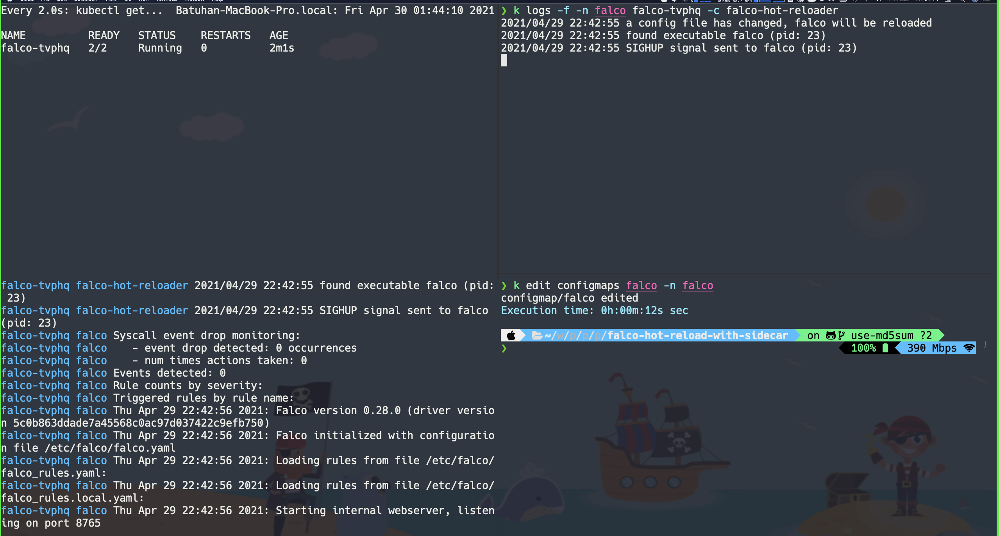

# Hot Reloading Support for Falco against its configuration and rule file changes in Kubernetes environment

The falco project has a builtin [hot-reload feature](https://falco.org/docs/getting-started/running/#hot-reload), so, what is our concern to do that kind of project ? Simple, the Falco project can reload itself when it receives a _SIGHUP_ signal, so, think of that scenario in a Kubernetes environment, the Falco uses a [ConfigMap](https://github.com/falcosecurity/charts/blob/master/falco/templates/configmap.yaml) which includes configuration and rule files for Falco can use. The thing we want to add as a support is monitoring these files and detecting changes againts them and sending _SIGHUP_ signal to the Falco. In order to do that we need to know a couple of things:

* How can access PID of the Falco process within the same Pod ?
* Are ConfigMaps mounted inside the Pod reloading itself againts updates ?

Let's start with explaining these two questions above:

## How can access PID of the Falco process within the same Pod ?

We know that Pod is a concept which can include one or more containers in it and we are generally using Pods with a one container inside of it. Sometimes we might need an extra container to assist the main container in Pod. So, how containers in the Pod can communicate each other ? There are multiple ways of doing this such as _Shared Volume_, _IPC_ and _localhost_ net interface etc. In our case, we are going to share process namespace between containers in a Pod, with that we will now be able to access the Falco container PID from a different container.

To get more detail about the concept, please follow the [link](https://kubernetes.io/docs/tasks/configure-pod-container/share-process-namespace/).

## Are ConfigMaps mounted inside the Pod reloading itself againts updates ?

There is a really well explained section about this question in the Kubernetes documentation and it says:

> When a ConfigMap currently consumed in a volume is updated, projected keys are eventually updated as well. The kubelet checks whether the mounted ConfigMap is fresh on every periodic sync. However, the kubelet uses its local cache for getting the current value of the ConfigMap. The type of the cache is configurable using the ConfigMapAndSecretChangeDetectionStrategy field in the KubeletConfiguration struct. A ConfigMap can be either propagated by watch (default), ttl-based, or by redirecting all requests directly to the API server. As a result, the total delay from the moment when the ConfigMap is updated to the moment when new keys are projected to the Pod can be as long as the kubelet sync period + cache propagation delay, where the cache propagation delay depends on the chosen cache type (it equals to watch propagation delay, ttl of cache, or zero correspondingly).                                                                                   ConfigMaps consumed as environment variables are not updated automatically and require a pod restart.

We can configure this sync frequency in the _Kubelet_ with a parameter called [--sync-frequency](https://kubernetes.io/docs/reference/command-line-tools-reference/kubelet/#--sync-frequency).


## Prerequisites

* minikube v1.19.0
* kubectl v1.21.0
* buildx v0.5.1-docker 11057da37336192bfc57d81e02359ba7ba848e4a
* helm v3.5.4+g1b5edb6

## Demo
First, we need to clone the _Falco Helm Chart_ repository.

```bash
$ git clone --depth=1 https://github.com/falcosecurity/charts
Cloning into 'charts'...
remote: Enumerating objects: 88, done.
remote: Counting objects: 100% (88/88), done.
remote: Compressing objects: 100% (83/83), done.
remote: Total 88 (delta 16), reused 23 (delta 1), pack-reused 0
Receiving objects: 100% (88/88), 101.19 KiB | 446.00 KiB/s, done.
Resolving deltas: 100% (16/16), done.
```

Then start your local _Minikube_ cluster.

```bash
$ minikube start --extra-arg=kubelet.sync-frequency="10s"
😄  minikube v1.19.0 on Darwin 10.15.7
✨  Using the virtualbox driver based on user configuration
👍  Starting control plane node minikube in cluster minikube
🔥  Creating virtualbox VM (CPUs=3, Memory=8192MB, Disk=20000MB) ...
🐳  Preparing Kubernetes v1.20.2 on Docker 20.10.4 ...
    ▪ kubelet.sync-frequency=10s
    ▪ Generating certificates and keys ...
    ▪ Booting up control plane ...
    ▪ Configuring RBAC rules ...
🔎  Verifying Kubernetes components...
    ▪ Using image gcr.io/k8s-minikube/storage-provisioner:v5
🌟  Enabled addons: storage-provisioner, default-storageclass
🏄  Done! kubectl is now configured to use "minikube" cluster and "default" namespace by default
```

Now, let's build and push our container image.

```bash
$ docker buildx -t $DOCKER_USERNAME/falco-hot-reloader:v1 .
...
```

> Buildx is a Docker CLI plugin for extended build capabilities with BuildKit, if you want to get more details about it, please follow the [link](https://github.com/docker/buildx).


Then go into the chart folder of the Falco and add these lines to the _daemonset.yaml_ file.
```yaml
shareProcessNamespace: true # to be able to access Falco process from the sidecar
containers:
- name: falco-hot-reloader
  image: devopps/hot-reloader-e3b38ca9a7f499a1b280629eff1473d3@sha256:63ce103e23bf358b15b2d71170066efa069795c165c6f55315ac4f37715489a7 # don't forget to replace here
  env:
  - name: FALCO_ROOTDIR
    value: /etc/falco
  volumeMounts:
  - mountPath: /etc/falco
    name: config-volume
```

Let's install the Falco chart.
```bash
$ helm upgrade --install falco charts/falco --namespace falco --create-namespace
Release "falco" does not exist. Installing it now.
NAME: falco
LAST DEPLOYED: Fri Apr 30 14:02:10 2021
NAMESPACE: falco
STATUS: deployed
REVISION: 1
TEST SUITE: None
NOTES:
Falco agents are spinning up on each node in your cluster. After a few
seconds, they are going to start monitoring your containers looking for
security issues.


No further action should be required.


Tip:
You can easily forward Falco events to Slack, Kafka, AWS Lambda and more with falcosidekick.
Full list of outputs: https://github.com/falcosecurity/charts/falcosidekick.
You can enable its deployment with `--set falcosidekick.enabled=true` or in your values.yaml.
See: https://github.com/falcosecurity/charts/blob/master/falcosidekick/values.yaml for configuration values.
```

> If you get the same error below, you can run simply "helm dependency update" first.                                                                                                           Release "falco" does not exist. Installing it now.                                                                                                                                              Error: found in Chart.yaml, but missing in charts/ directory: falcosidekick

Verify if everything is working before move on.

```bash
$ kubectl get pods --namespace falco
NAME          READY   STATUS    RESTARTS   AGE
falco-7269h   2/2     Running   0          59s
```

Now, open the logs of the Falco pod, and then change something inside of the _ConfigMap_ which is in _falco_ namespace, you should see similar output above:
```bash
$ kubectl logs -f falco-7269h --namespace falco
...
# these logs belongs to a falco-hot-reloader container
2021/04/30 11:09:16 a config file has changed, falco will be reloaded 
2021/04/30 11:09:16 found executable falco (pid: 19)
2021/04/30 11:09:16 SIGHUP signal sent to falco (pid: 19)
...

# these logs belongs to a falco container
Fri Apr 30 11:09:16 2021: SIGHUP received, restarting...
2021/04/30 11:09:16 starting to watch file: /etc/falco/falco_rules.yaml
2021/04/30 11:09:16 a config file has changed, falco will be reloaded
2021/04/30 11:09:16 found executable falco (pid: 19)
2021/04/30 11:09:16 SIGHUP signal sent to falco (pid: 19)
Syscall event drop monitoring:
   - event drop detected: 0 occurrences
   - num times actions taken: 0
Events detected: 0
Rule counts by severity:
Triggered rules by rule name:
Fri Apr 30 11:09:16 2021: Falco version 0.28.0 (driver version 5c0b863ddade7a45568c0ac97d037422c9efb750)
Fri Apr 30 11:09:16 2021: Falco initialized with configuration file /etc/falco/falco.yaml
Fri Apr 30 11:09:16 2021: Loading rules from file /etc/falco/falco_rules.yaml:
Fri Apr 30 11:09:16 2021: Loading rules from file /etc/falco/falco_rules.local.yaml:
Fri Apr 30 11:09:16 2021: Starting internal webserver, listening on port 8765
```
